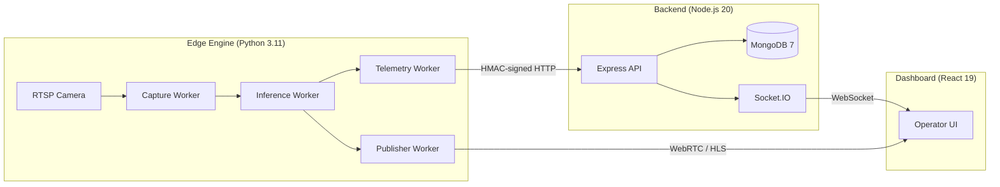

<div align="center">

# 🛡️ TransGuard AI

**6-Pillar AI Surveillance Platform**

Real-time edge detection • WebRTC streaming • Operator dashboard

[](https://nodejs.org/)
[](https://python.org/)
[](https://docker.com/)
[](https://www.mongodb.com/)

</div>

---

## Overview

TransGuard AI is a production-grade AI surveillance platform that combines a **Python edge engine** (YOLO + ByteTrack + MediaPipe + face_recognition) with a **Node.js real-time backend** (Express + Socket.IO + MongoDB) and a **React operator dashboard** — all containerized with Docker for single-command deployment.

The system processes live RTSP camera feeds through six independent AI detection pillars, raises real-time alerts via WebSocket, and provides operators with a cinematic glassmorphism dashboard for monitoring and incident management.

### Technical Documentation
- **[Mobile Camera RTSP Demo & Transit Testing Guide](docs/MOBILE_DEMO_GUIDE.md)** — Simple English step-by-step instructions for running the complete 6-pillar surveillance demo using a smartphone camera (no physical hardware required).
- **[Master Architecture & Project State Manual](docs/PROJECT_ARCHITECTURE_AND_STATE.md)** — Complete architectural specification, security models, test matrix, and historical evolution (7.5 to 10/10) for AI models and engineers.
- **[System Block Diagrams & Circuit Schematics](docs/DIAGRAMS.md)** — Complete software/hardware block diagrams, sequence flowcharts, and electronic circuit schematics with Bill of Materials.
- **[Computer Vision Mathematical Architecture](docs/TECHNICAL_ARCHITECTURE.md)** — Mathematical formulations, skeletal geometry, and temporal confirmation algorithms for the 6 edge detection pillars.

## Architecture



## 6 AI Detection Pillars

| # | Pillar | Method | Key Parameters |
|:-:|:-------|:-------|:---------------|
| 1 | **Overcrowding** | Person count with temporal consensus | `CROWD_PERSON_THRESHOLD=2`, `CROWD_CONSENSUS_FRAMES=15` |
| 2 | **Unattended Baggage** | Stationary object + owner proximity | `BAGGAGE_STATIONARY_SECONDS=10`, `BAGGAGE_PROXIMITY_RADIUS_PX=120` |
| 3 | **Fall Detection** | MediaPipe skeletal geometry (torso angle + bbox aspect ratio) | `FALL_ANGLE_THRESHOLD_DEG=45`, `FALL_CONFIRM_FRAMES=5` |
| 4 | **Weapon Detection** | Secondary fine-tuned YOLO on person crops | `WEAPON_CONF_THRESHOLD=0.45`, `WEAPON_CONFIRM_FRAMES=3` |
| 5 | **Violence Detection** | IoU overlap + wrist velocity via pose estimation | `VIOLENCE_IOU_THRESHOLD=0.15`, `VIOLENCE_WRIST_SPEED_PX_S=320` |
| 6 | **Face Detection & Watchlist** | Deep metric learning (128-d ResNet embeddings) with upper-body RoI search and track memoisation | `FACE_MATCH_TOLERANCE=0.50`, `WATCHLIST_SYNC_SECONDS=300` |

**Additional capabilities:** ByteTrack multi-object tracking, low-latency WebRTC live broadcast, and real-time public transit GPS map tracking.

## Quick Start

### Option 1: Docker Compose (Recommended)

```bash
# Clone the repo
git clone https://github.com/your-org/transguard-ai.git
cd transguard-ai

# Copy environment templates
cp .env.example .env
cp .env.edge.example .env.edge

# Edit .env with your secrets (JWT_SECRET, DEFAULT_ADMIN_PASSWORD, etc.)

# Start dashboard + MongoDB
docker compose up -d

# Start full stack with AI engine (requires RTSP camera)
docker compose --profile full up -d

# Scale to 3 camera engines
docker compose --profile full up -d --scale engine=3
```

### Option 2: Local Development

```bash
# Backend
npm install
cp .env.example .env     # Edit with your values
node server.js

# Frontend (separate terminal)
cd frontend
npm install
npm run dev              # Vite dev server on :5173

# Python engine (separate terminal)
pip install -r requirements.txt
python trans_guard_engine.py --camera cam0 --url rtsp://your-camera:554/stream
```

### Default Credentials

| Role | Username | Password | Notes |
|:-----|:---------|:---------|:------|
| Admin | `admin` | `TransGuard@2026!` | Set via `DEFAULT_ADMIN_PASSWORD` env var |

> ⚠️ **Change the default password immediately in production.**

## Environment Variables

### Backend (`.env`)

| Variable | Default | Description |
|:---------|:--------|:------------|
| `MONGO_URI` | `mongodb://127.0.0.1:27017/transguard` | MongoDB connection string |
| `JWT_SECRET` | `transguard-dashboard-jwt-secret` | JWT signing secret (change in production!) |
| `DEFAULT_ADMIN_PASSWORD` | `TransGuard@2026!` | Initial admin password (dev seeding only) |
| `DEFAULT_EDGE_API_KEY` | `transguard-edge-secret-key-9042` | Initial edge node API key |
| `PORT` | `5000` | HTTP server port |
| `NODE_ENV` | `development` | `development` or `production` |
| `CORS_ORIGINS` | _(empty = allow all)_ | Comma-separated allowed origins |
| `MAX_EVIDENCE_BYTES` | `5242880` (5 MB) | Max evidence image upload size |

### Edge Engine (`.env.edge`)

| Variable | Default | Description |
|:---------|:--------|:------------|
| `RTSP_URL` | `rtsp://host.docker.internal:8554/cam0` | Camera RTSP stream URL |
| `BACKEND_URL` | `http://host.docker.internal:5000` | Backend API endpoint |
| `EDGE_API_KEY` | `transguard-edge-secret-key-9042` | API key (must match backend) |
| `CAMERA_ID` | `cam0` | Unique camera identifier |
| `YOLO_MODEL` | `yolov8n.pt` | Primary YOLO model path |
| `WEAPON_MODEL` | `yolov8n-weapons.pt` | Weapon detection model path |
| `YOLO_CONF` | `0.45` | Detection confidence threshold |

## API Reference

### Authentication
| Method | Endpoint | Auth | Description |
|:-------|:---------|:-----|:------------|
| `POST` | `/api/auth/login` | None | Login with username/password, returns JWT |
| `POST` | `/api/auth/register` | JWT (Admin) | Create a new operator or admin user |

### Alerts & Incidents
| Method | Endpoint | Auth | Description |
|:-------|:---------|:-----|:------------|
| `POST` | `/api/alerts` | Edge API Key | Ingest incident (multipart/form-data) |
| `GET` | `/api/alerts/history` | JWT | Fetch last 100 incidents |
| `PATCH` | `/api/alerts/:id/acknowledge` | JWT | Mark incident as REVIEWED/DISMISSED |

### Edge Node Management
| Method | Endpoint | Auth | Description |
|:-------|:---------|:-----|:------------|
| `POST` | `/api/edge/heartbeat` | Edge API Key | Camera heartbeat with FPS/status |
| `GET` | `/api/edge/cameras` | JWT | List all active cameras |
| `POST` | `/api/edge/zone` | JWT | Set geofence polygon for a camera |
| `GET` | `/api/edge/zone/:camera_id` | Edge API Key | Get zone polygon |
| `POST` | `/api/edge/provision` | JWT | Spawn a Python engine for a camera |

### Watchlist
| Method | Endpoint | Auth | Description |
|:-------|:---------|:-----|:------------|
| `GET` | `/api/watchlist` | Edge API Key | Get active watchlist targets |
| `POST` | `/api/watchlist` | JWT | Upload a new watchlist target |

### System
| Method | Endpoint | Auth | Description |
|:-------|:---------|:-----|:------------|
| `GET` | `/api/health` | None | Health check (MongoDB status, uptime, version) |
| `GET` | `/api/control/status` | JWT | Get monitoring enabled/disabled state |
| `POST` | `/api/control/toggle` | JWT | Toggle monitoring on/off |

## Testing

```bash
# Run all tests (Python + Backend)
npm test

# Python AI engine tests only (22 tests)
npm run test:python

# Backend API integration tests only (Jest + Supertest)
npm run test:backend

# Frontend component tests (Vitest + React Testing Library)
cd frontend && npm test
```

### Test Coverage

| Layer | Framework | Tests | Coverage |
|:------|:----------|------:|:---------|
| AI Engine | Python `unittest` | 22 | Geometry, crowd detection, fall detection, violence detection |
| Backend API | Jest + Supertest | 20 | Auth, alerts, edge routes, health, RBAC, validation |
| Frontend UI | Vitest + RTL | 10+ | ErrorBoundary, Skeleton, ToastProvider, LoginView |

## Security

| Layer | Measure |
|:------|:--------|
| **Passwords** | bcrypt with 12 salt rounds, never stored in plaintext |
| **API Keys** | SHA-256 hashed at rest, raw key never persisted |
| **Request Integrity** | HMAC-SHA256 signing with `crypto.timingSafeEqual` |
| **Input Validation** | Joi schemas on every mutating endpoint |
| **Rate Limiting** | 5 login attempts per 15 min, 15 alerts per second |
| **HTTP Security** | Helmet (CSP, HSTS, X-Frame-Options, X-Content-Type-Options) |
| **Containers** | Non-root users (`transguard`, `engineuser`) in all Docker images |
| **Secrets** | `.env` files excluded from Git and Docker image layers |
| **RBAC** | Admin-only routes for user registration and provisioning |

## Deployment

### Docker (Production)

```bash
docker compose up -d                          # Dashboard + MongoDB
docker compose --profile full up -d           # Full stack with AI engine
```

### Render (PaaS)

Connect this repo to [Render](https://render.com) — the included `render.yaml` blueprint auto-configures the backend service. Set `MONGO_URI` (MongoDB Atlas recommended) and `JWT_SECRET` in the Render dashboard.

### GPU Acceleration

Uncomment the `deploy.resources` block in `docker-compose.yml` to enable NVIDIA GPU passthrough for the AI engine. Requires [NVIDIA Container Toolkit](https://docs.nvidia.com/datacenter/cloud-native/container-toolkit/install-guide.html).

## Project Structure

```
transguard-ai/
├── server.js                  # Express + Socket.IO backend (783 lines)
├── trans_guard_engine.py      # Python edge engine entrypoint
├── engine/                    # Modularized AI Engine
│   ├── main.py                # Process orchestration (Capture, Inference, Publisher, Telemetry)
│   ├── config.py              # Centralized engine config
│   ├── utils/                 # Geometry, queues, logging
│   └── detectors/             # AI Pillars (baggage.py, crowd.py, pose.py, violence.py, watchlist.py, weapon.py)
├── frontend/                  # React 19 + Vite + Tailwind dashboard
│   ├── src/
│   │   ├── App.jsx
│   │   ├── components/        # Sidebar, WebRTCPlayer, Toast, charts/, etc.
│   │   ├── pages/             # LoginView.jsx
│   │   └── views/             # Modular dashboard views (Insights, Map, Watchlist, etc.)
│   └── vite.config.js
├── models/                    # Mongoose schemas
│   ├── Incident.js
│   ├── EdgeNode.js
│   ├── User.js
│   └── WatchlistTarget.js
├── middleware/
│   ├── auth.js                # JWT + HMAC + Edge API key verification
│   └── validate.js            # Joi validation middleware + schemas
├── jobs/
│   └── retentionCron.js       # 30-day incident purge
├── utils/
│   └── logger.js              # Winston structured logging
├── tests/
│   ├── test_fusion_detectors.py  # Python AI unit tests (22 tests)
│   └── backend/                  # Jest API integration tests
├── docker/
│   └── engine-entrypoint.sh   # Engine process supervisor
├── Dockerfile.backend         # Multi-stage Node.js build
├── Dockerfile.engine          # Multi-stage Python build (dlib, FFmpeg, MediaMTX)
├── docker-compose.yml         # 3-service orchestration with profiles
├── render.yaml                # Render PaaS deployment blueprint
├── .env.example               # Backend env template
└── .env.edge.example          # Edge engine env template
```

## License

ISC
